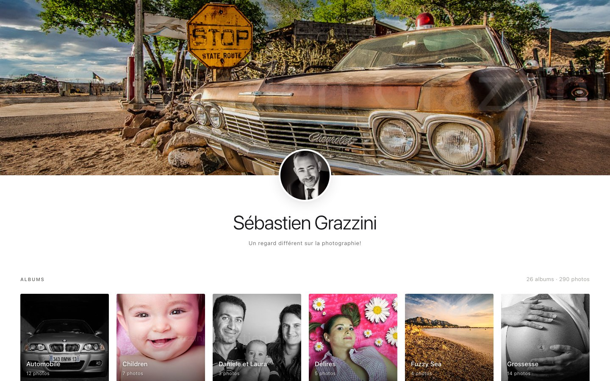
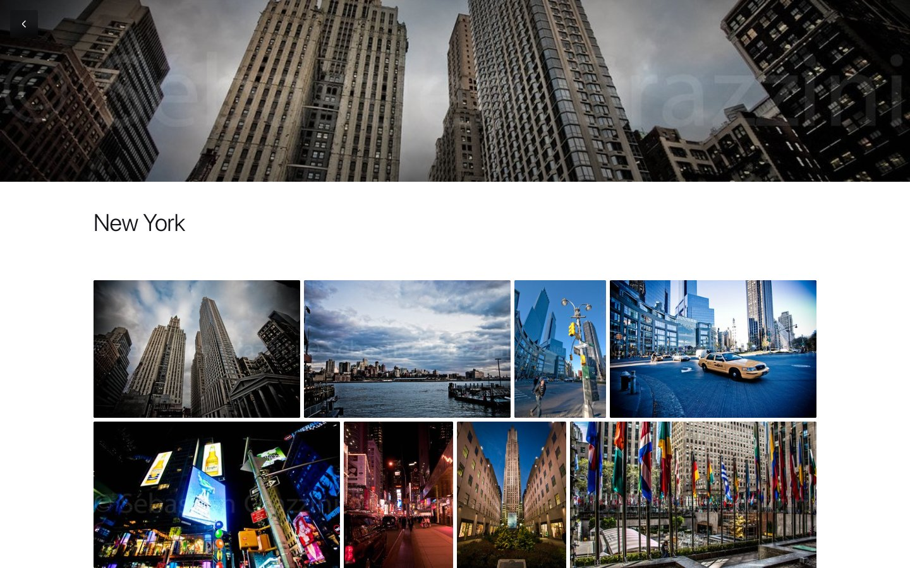
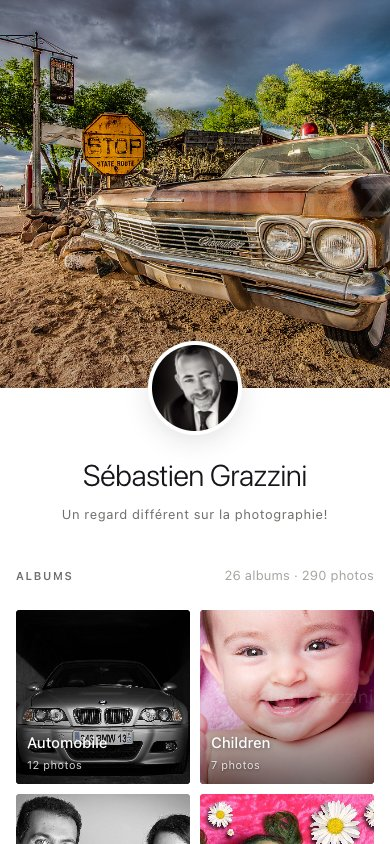

# bookphoto

> A private photo gallery you own — driven entirely from your terminal.



## What if your photo gallery was just… a CLI?

**What if your gallery went live with a single command — on infrastructure you actually own?** **And what if you could run your entire photo website straight from your terminal — every album, every update, a command line away?**

That's bookphoto. `gallery init` deploys a private, serverless gallery to **your own** AWS (S3 + CloudFront, one shared password). Add your photos, then `gallery push` publishes them — no platform, no subscription, no middleman. You keep the infra, the data, and the URL. And since it's all a CLI, it's as easy to automate — or hand off to an AI agent — as it is to type.

## Why bookphoto

- 🔒 **Private by default** — a locked-down S3 bucket, reachable only through CloudFront (Origin Access Control, SigV4).
- 🔑 **One shared password** (fixed user `invite`); set it to `-` for a fully public gallery.
- 🪶 **Serverless & static** — a single-file SPA (`index.html` + `data.json`); no server to run, no database.
- ⚡ **Incremental publish** — `gallery push` mirrors only what changed to S3 and invalidates CloudFront.
- 🧰 **No AWS CLI required** — everything goes through **boto3**, bundled with the tool.
- 🤖 **Human- and agent-friendly** — plain commands you can script, pipe, or let an AI agent drive end to end.

## One folder = one gallery

You `cd` into a folder, `gallery init` creates it, deploys it to AWS and puts it online. Everything — branding, albums, config, build — lives **in that folder**. Multiple galleries = multiple independent folders, no global state.

## Requirements

- **Python 3.12+**
- [uv](https://docs.astral.sh/uv/) — `brew install uv`
- AWS credentials (`~/.aws`) with the permissions from `gallery iam-policy` (see [docs/architecture.md](docs/architecture.md)).

## Install

```bash
uv tool install --editable .   # from the cloned repo
gallery --version
```

AWS credentials (any of): a `~/.aws/credentials` profile (recommended), environment variables (`AWS_ACCESS_KEY_ID`…), or SSO (`aws sso login`). bookphoto only remembers the profile **name** (`--profile`), never your secrets.

## Quick start

```bash
mkdir my-book && cd my-book       # the folder is the site
gallery init                       # branding + AWS deploy + go live (interactive)

gallery new "Night streets"        # create an album (asks for a description)
gallery add night-streets ~/photos/*.jpg   # copy, read EXIF, generate derivatives
gallery preview                    # local preview (http://127.0.0.1:8000)
gallery push                       # publish (S3 mirror + password + CloudFront invalidation)
```

`gallery init` asks for: name, tagline, cover image, avatar, **password** (`invite`; `-` for a public gallery), copyright — then provisions the CloudFormation stack and publishes. Options: `--region`, `--profile`.

## Commands

| Command | What it does |
|---|---|
| `init` | Create the site here, **provision the AWS infra** and go live |
| `config` | View / edit branding and password |
| `new "<title>"` | Create an album |
| `add <album> <files>` | Add photos (copy + EXIF date + derivatives) |
| `import <folder>` | Bulk import: one subfolder = one album |
| `album <slug>` | Edit an album (title, description, cover, header) |
| `headers on\|off\|auto` | Global override of the album cover banner |
| `remove <album> [files]` | Remove photos (or the whole album) |
| `list` | List albums |
| `preview [--port]` | Local preview (builds the SPA + HTTP server) |
| `push` | Publish: build + incremental S3 mirror + password + CloudFront invalidation |
| `pull "<name>"` | Clone an existing gallery from AWS (by **name**) |
| `destroy [--yes]` | Tear down this site's AWS infra (empties the bucket + deletes the stack) |
| `doctor` | Diagnostics (read-only) |
| `iam-policy` | Print the minimal required IAM policy |

Full reference: [docs/commands.md](docs/commands.md).

## A look inside

| Album view | Mobile |
|---|---|
|  |  |

## Site layout (the folder)

```
my-book/
  site.yaml        # branding: name, tagline, cover, avatar, copyright, header_override
  .bookphoto.json  # machine config (region, bucket, distribution, url, profile, stack…) — written by init
  assets/          # branding images (cover, avatar)
  <slug>/
    album.yaml     # title, description, cover, header, photos:[{file, date, caption}]
    photos/        # copied originals
    thumbs/        # thumbnails (≤ 400 px)
    display/       # display versions (≤ 2048 px)
  index.html       # generated SPA (git-ignored)
  data.json        # generated gallery data (git-ignored)
```

`gallery init` writes a `.gitignore` excluding `.bookphoto.json`, `index.html` and `data.json`.

## Cost

No compute, no database — you pay only for **storage** and **delivery**. For a private personal gallery (~10 GB of photos, light traffic) in **eu-west-1 (Ireland)**, the real bill is **≈ $0.28 / month**, almost entirely S3 storage:

- **S3 storage** — 10 GB × $0.023/GB = **$0.23**
- **S3 requests** — 100k GET + a few thousand PUT = **$0.05**
- **CloudFront** — 20 GB out + 100k requests = **$0.00**: covered by the always-free tier (**1 TB egress + 10M requests/month**; S3→CloudFront transfer is free)
- **CloudFront Function** (auth on every request) — **$0.00**: within the 2M free invocations/month

Heads-up: the [AWS Pricing Calculator](https://calculator.aws/) does **not** subtract the always-free tier, so it quotes ~$1.80/month for that CloudFront line (20 GB × $0.085 + requests). You only actually pay it once you pass 1 TB / 10M requests a month — e.g. a busy **public** gallery, which then scales at **~$0.085/GB** (US/EU).

## Tests

```bash
uv run pytest
```

## License

MIT — see [LICENSE](LICENSE).
