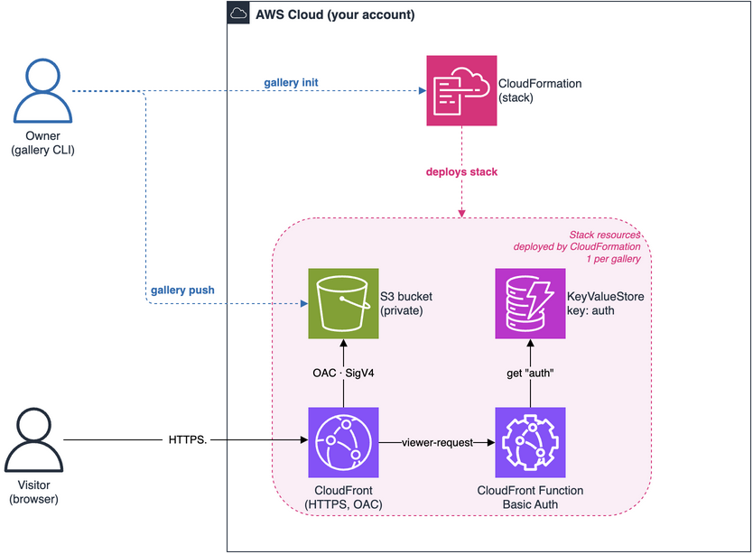

# AWS architecture & security

## Overview



```
Browser ──HTTPS──▶ CloudFront ──(viewer-request)──▶ CloudFront Function ──▶ KeyValueStore
                       │                                   │  (key "auth")
                       │  Origin Access Control (SigV4)     └─ Basic Auth: 401 if wrong
                       ▼
                     S3 (private)
```

Everything is **static** — no server, no origin Lambda. The gallery (SPA + images) sits in a
**private** S3 bucket and is delivered by CloudFront. Defined in
[`../src/bookphoto/aws/infra.yaml`](../src/bookphoto/aws/infra.yaml). Naming: stack
`bookphoto-<slug(name)>`, bucket `bookphoto-<slug(name)>-<accountId>`.

## Components

- **S3** — private end to end: all public access blocked, `BucketOwnerEnforced`, AES256. The
  bucket policy allows `s3:GetObject` **only** to CloudFront, and only for *this* distribution
  (`AWS:SourceArn`). Nobody else can read it.
- **Origin Access Control (OAC)** — CloudFront signs its requests to S3 with SigV4.
- **CloudFront** — HTTPS-only, HTTP/2+3, cheapest price class by default (`PriceClass_100`).
  403/404 are rewritten to `/index.html` (SPA routing, and no object listing leaks).
- **KeyValueStore + CloudFront Function** — the access control (see below).

## Password & security

- **One shared password**, fixed user **`invite`**. The password is written to a CloudFront
  **KeyValueStore** under the key `auth`, as `base64("invite:<password>")`.
- On every request, a **CloudFront Function** (`viewer-request`) reads `auth` and:
  - if the value is `-` → **public gallery** (passes through);
  - else compares the `Authorization` header to `Basic <auth>` → passes if equal;
  - else returns **401**.
- **Fail-closed**: if the KVS is unreadable or empty, access is denied (401).
- Changing the password is a single write to the KVS (done by `push`/`config`) — **no redeploy**.

**Scope, honestly:** this is access control via a *shared* password, not per-user auth — one
secret for everyone, no individual accounts or revocation. The password is stored in clear text
in `.bookphoto.json` (local, **git-ignored** by `init`) — don't commit or share it. Transport
is HTTPS; the bucket is never exposed directly.

## Minimal IAM policy

`gallery iam-policy` prints the exact policy. Rule: **no `Resource: "*"`** except for actions
with no resource (`sts:GetCallerIdentity`) or creation actions whose resource doesn't exist yet
(`cloudfront:Create*`); everything else is scoped to `bookphoto-*` ARNs.

```bash
gallery iam-policy > bookphoto-policy.json   # attach to the user/role that runs gallery
```
